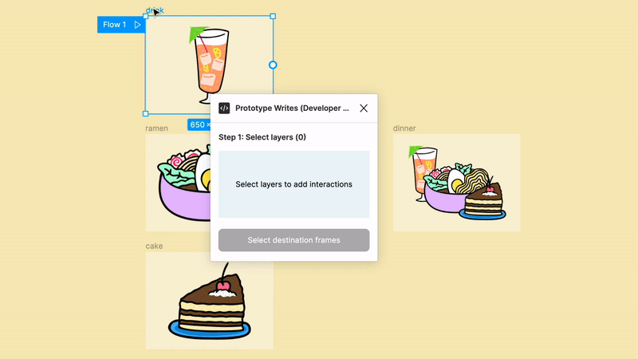

# 🍜 figma-plugin-example-prototype-write



The ability to write protoype interactions in the Figma plugin API has landed! This update allows plugins to create new prototype interactions in the editor.

Check out the [Figma plugin API docs](https://www.figma.com/plugin-docs/intro/) to learn more about writing plugins.

### Understanding reactions
Under the hood, interactions are stored in the `reactions` array. A node can have multiple reaction objects and each is comprised of an `action` and a `trigger`. The `action` defines "what happens?" and the `trigger` defines "how will it happen?"

Here's an example `reactions` array with a single reaction:
```
[
    {
        "action": {
            "type": "NODE",
            "destinationId": "2:1",
            "navigation": "NAVIGATE",
            "transition": null,
            "preserveScrollPosition": false
        },
        "trigger": {
            "type": "ON_CLICK"
        }
    }
]
```

### Setting reactions
Like [many of the complex properties](https://www.figma.com/plugin-docs/editing-properties/), the `action` and `trigger` objects are `readonly` meaning you can't directly edit those properties. Instead, you'll want to make a copy of the reaction object or the entire `reactions` array. If your cloning individual reaction objects inside the array, **Create Figma Plugin** has [some useful utilities](https://yuanqing.github.io/create-figma-plugin/#object).

### Building valid reactions
There's a range of different reactions in Figma and not all are compatible with eachother or have different reaction properties. While some of these will be caught during development (thanks to typings), you'll want to ensure your plugin properly checks for valid reactions.


## Development guide

This plugin example is built using [Create Figma Plugin](https://yuanqing.github.io/create-figma-plugin/) by [
Yuan Qing Lim](https://github.com/yuanqing). It's an excellent boilerplate for new Figma plugins and comes packed with a ton of useful utilities.

**Note:** This plugin uses esbuild for JavaScript bundling (built by Figma cofounder [Evan Wallace](https://github.com/evanw)!). While fairly stable, the project is still in active development.

### Pre-requisites

- [Node.js](https://nodejs.org) – v14
- [Figma desktop app](https://figma.com/downloads/)

### Build the plugin

To build the example plugin:

```
$ npm run build
```

This will generate a [`manifest.json`](https://figma.com/plugin-docs/manifest/) file and a `build/` directory containing a JavaScript bundle for the plugin.

To watch for code changes and rebuild the plugin automatically:

```
$ npm run watch
```

### Install the plugin

In the Figma desktop app:

1. Open a Figma document.
2. Go to `Plugins` → `Development` → `New Plugin…`.
3. Click the `Click to choose a manifest.json file` box, and select the `manifest.json` file that was generated.

### Debugging

Use `console.log` statements to inspect values in your code.

To open the developer console in the Figma desktop app, go to `Plugins` → `Development` → `Open Console`.

## See also

- [Create Figma Plugin docs](https://yuanqing.github.io/create-figma-plugin/)
- [Storybook](https://yuanqing.github.io/create-figma-plugin/ui/)
- [Figma plugin API docs](https://figma.com/plugin-docs/api/)
- [`figma/plugin-samples`](https://github.com/figma/plugin-samples)
- [`yuanqing/figma-plugins`](https://github.com/yuanqing/figma-plugins)
